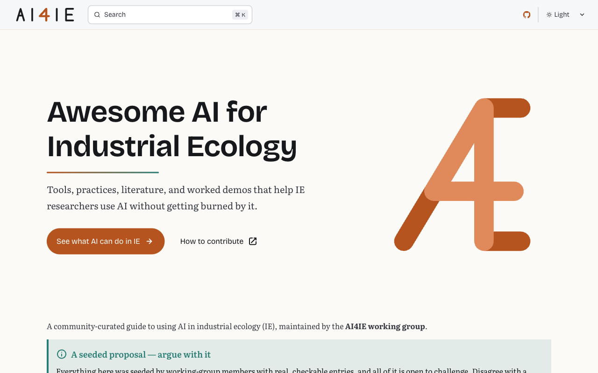

# Awesome AI for Industrial Ecology

**A community-curated resource for using AI in industrial ecology research,
maintained by the [AI4IE working group](CONTRIBUTING.md).**

[](https://simonvanlierde.github.io/ai4ie-demo/)
[](CONTRIBUTING.md)
[](https://github.com/simonvanlierde/ai4ie-demo/actions)
[](https://codecov.io/gh/simonvanlierde/ai4ie-demo)
[](https://astro.build)
[](LICENSE)

**See it live: [simonvanlierde.github.io/ai4ie-demo](https://simonvanlierde.github.io/ai4ie-demo/)**

<a href="https://simonvanlierde.github.io/ai4ie-demo/">
  
</a>

## What this is

A **scaffold**, not finished work. Placeholder content and `TODO(wg)` markers throughout,
waiting for working-group members to fill in. Contributions are the whole point.

| Page | Contents |
|---|---|
| [Best practices & guides](src/content/docs/best-practices.md) | Get-started guides, verification checklists, reusable prompts, Claude skill files. |
| [Tools & hardware](src/content/docs/tools.md) | Recommended software, services, libraries — and hardware to run models locally. |
| [Map of AI in IE](src/content/docs/applications-map/index.mdx) | A two-dimensional map of AI applications by IE field and AI technique. |
| [Literature & resources](src/content/docs/literature.mdx) | Tag-filterable reading list backed by `src/data/literature.yaml`. |

## Contributing

Edit a Markdown file under `src/content/docs/`, replace a `TODO(wg)`, open a pull request.
No local setup needed to edit prose — see [CONTRIBUTING.md](CONTRIBUTING.md).

## How it's built

[Astro](https://astro.build) + the [Starlight](https://starlight.astro.build) docs theme.
Content is plain Markdown/MDX; interactive demos are **Astro islands**, so pages that don't
use one ship zero JavaScript. Pushing to `main` builds and deploys to GitHub Pages.

| Where | What |
|---|---|
| `src/content/docs/*.md` | Page content (`.mdx` when a page embeds a component). |
| [`astro.config.mjs`](astro.config.mjs) | Sidebar, theme, site config. |
| [`src/styles/custom.css`](src/styles/custom.css) | Brand colors. |
| [`src/components/DemoIsland.tsx`](src/components/DemoIsland.tsx) | Example interactive island. |
| [`.github/workflows/ci.yml`](.github/workflows/ci.yml) | Lint, test, build, deploy. |

Preview locally (needs Node 26+):

```bash
npm install
npm run dev        # → http://localhost:4321/ai4ie-demo/
```

## License

[CC-BY-4.0](LICENSE)
